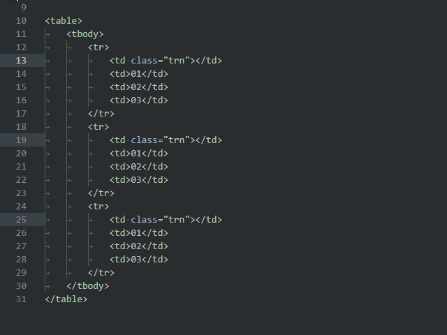
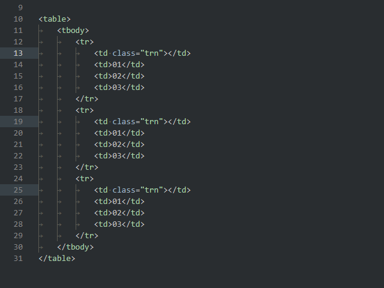
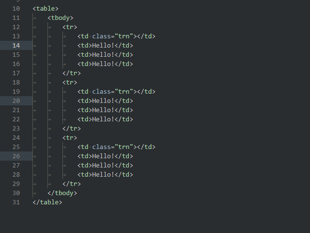

# Interval editing

This extension divides selected lines or lines between first and last cursor to many edit points with equal intervals between lines.

If you need to edit at once several lines with the same indents between each other - this extension help you.

To use it You need:
1. Set two cursors to first and last lines that you wish to editing, or select text from first to last this lines.
2. Press **Shift+Alt+L** repeatedly.
After each next press the designated interval will be separated to some edit points with increasing step.
3. Keep clicking until you get a match with needed to edit lines.

In the settings **Ctrl+, >> Extensions >> Interval editing** you may set how to select the edited lines:
- full line
- only text of line
- set cursor to start or end of line or of line text